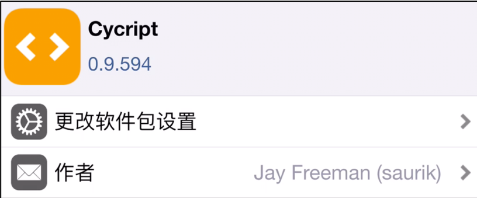
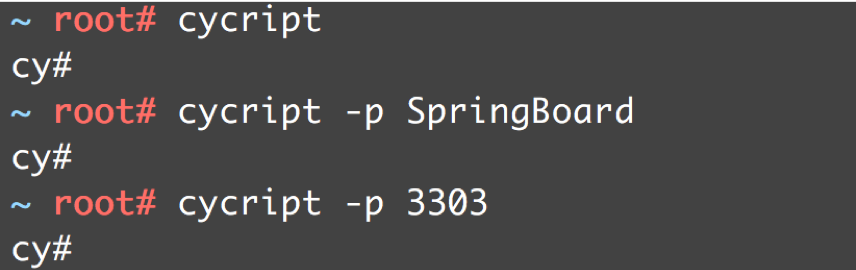
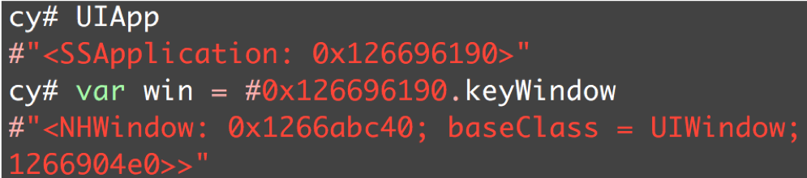
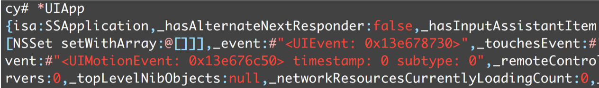
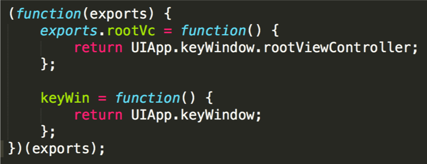
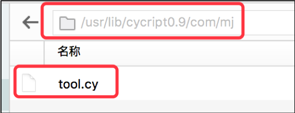
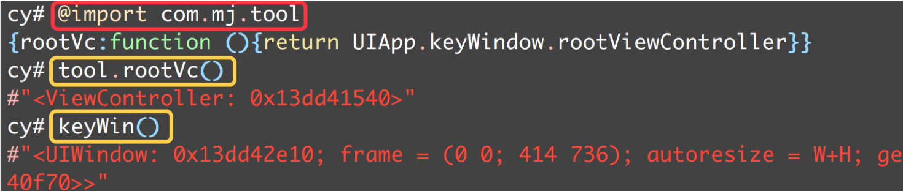

# Cycript

Cycript是Objective-C++、ES6（JavaScript）、Java等语法的混合物  
可以用来探索、修改、调试正在运行的Mac\iOS APP  
官网： http://www.cycript.org/  
文档： http://www.cycript.org/manual/  

通过Cydia安装Cycript，即可在iPhone上调试运行中的APP




主要功能:


## 开启
```
cycript
cycript -p 进程ID
cycript -p 进程名称
```



- 取消输入：Ctrl + C
- 退出：Ctrl + D
- 清屏：Command + R

## 常用语法

1. UIApp  
```
[UIApplication sharedApplication]
```


2. 定义变量  
var 变量名 = 变量值

3. 用内存地址获取对象  
#内存地址

4. ObjectiveC.classes  
已加载的所有OC类

5. 查看对象的所有成员变量
*对象



6. 递归打印view的所有子控件（跟LLDB一样的函数）
```  
view.recursiveDescription().toString()
```

7. 筛选出某种类型的对象  
```
choose(UIViewController)  
choose(UITableViewCell)
```

## 封装Cycript 

我们可以将常用的Cycript代码封装在一个.cy文件中

1. exports参数名固定，用于向外提供接口


2. 将.cy文件存放到/usr/lib/cycript0.9目录下


3. 在Cycript中引用.cy文件，并使用它提供的接口

