# 认识MachO

## 简介
MachO文件是mac平台上一类文件的简称，它的类型有以下种类，可以在`#import <mach-o/loader.h>`文件中找到

```
#define MH_OBJECT   0x1     /* relocatable object file */
#define MH_EXECUTE  0x2     /* demand paged executable file */
#define MH_FVMLIB   0x3     /* fixed VM shared library file */
#define MH_CORE     0x4     /* core file */
#define MH_PRELOAD  0x5     /* preloaded executable file */
#define MH_DYLIB    0x6     /* dynamically bound shared library */
#define MH_DYLINKER 0x7     /* dynamic link editor */
#define MH_BUNDLE   0x8     /* dynamically bound bundle file */
#define MH_DYLIB_STUB   0x9     /* shared library stub for static */
                    /*  linking only, no section contents */
#define MH_DSYM     0xa     /* companion file with only debug */
                    /*  sections */
#define MH_KEXT_BUNDLE  0xb     /* x86_64 kexts */
```

列举一些常见的类型

| 文件类型 | 含义 |
|------|-------|
| MH_OBJECT | 目标文件，平时.o结尾的文件 |  
| MH_EXECUTE | 可执行文件，我们平时编译后的包中的执行文件 |   
| MH_DYLIB | 一些动态库，该文件夹下很多/usr/lib/xxx.dylib |   
| MH_DSYM | 符号文件，编译成功后XXX.app.dSYM |   

## MachO的组成
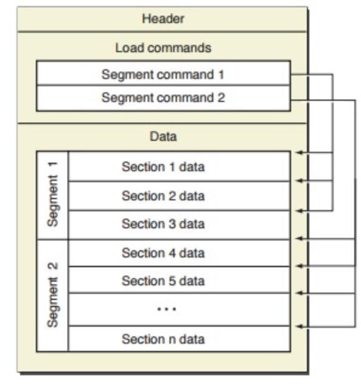

每个Macho文件都会有个Header对这个Macho进行整体描述，这个header根据你打包的选择的架构又分为Fat Header 和 Mach Header，先介绍下如何生成这2个文件类型
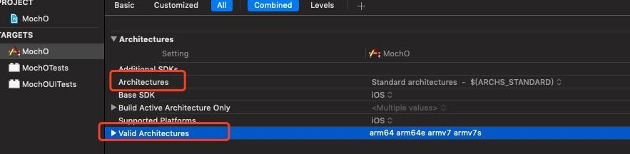

Architectures和valid Architectures 的交集就是最后打的包的架构，Architectures后面是标准的架构，我把项目设置为iOS8选择真机，将build改成release，会编译出一开始的展示的MochO_arm_fat文件放到MachOView中   
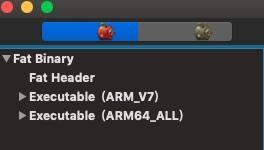

然后选择模拟器将build改成debug ,build会出现MochO_x86  
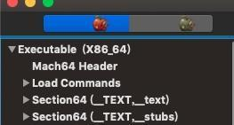

###  fat_header

#### fat_header 结构
```
struct fat_header {
	uint32_t	magic;		/* FAT_MAGIC or FAT_MAGIC_64 */
	uint32_t	nfat_arch;	/* number of structs that follow */
};
```

1. magic： 描述文件类型 值分为2组分别为 FAT_CIGAM(0xbebafeca)、 FAT_MAGIC(0xcafebabe)和FAT_CIGAM_64(0xbfbafeca)、FAT_MAGIC_64(0xcafebabf)，值也就是大小端的区别；
2. nfat_arch：描述当前fat有多少个架构。

### fat_arch 结构
说到fat_header的nfat_arch会描述有多少个架构，其实架构的类型就是fat_arch类型的，结构如下
```
struct fat_arch {
	cpu_type_t	cputype;	/* cpu specifier (int) */
	cpu_subtype_t	cpusubtype;	/* machine specifier (int) */
	uint32_t	offset;		/* file offset to this object file */
	uint32_t	size;		/* size of this object file */
	uint32_t	align;		/* alignment as a power of 2 */
};
```
1. cputype：说明CPU的类型一般有CPU_TYPE_X86、CPU_TYPE_X86_64、CPU_TYPE_ARM64、CPU_TYPE_ARM；
2. cpusubtype： 对cpu类型的具体划分一般有CPU_SUBTYPE_I386_ALL、CPU_SUBTYPE_X86_ALL、CPU_SUBTYPE_ARM_V7、CPU_SUBTYPE_ARM_V7S；
3. offset： 当前架构的偏移量；
4. size：当前架构的大小；
5. align：对齐大小。

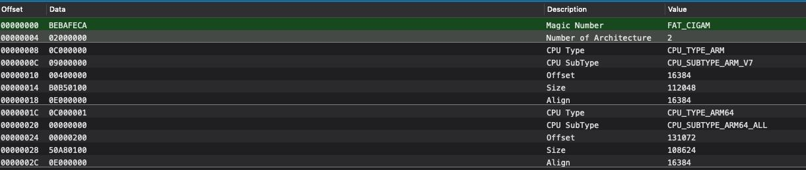

也可以用otool查看

```
otool -f  Macho文件路径
```

```
Fat headers
fat_magic 0xcafebabe
nfat_arch 2
architecture 0
    cputype 12
    cpusubtype 9
    capabilities 0x0
    offset 16384
    size 112048
    align 2^14 (16384)
architecture 1
    cputype 16777228
    cpusubtype 0
    capabilities 0x0
    offset 131072
    size 108624
    align 2^14 (16384)
```

上面可以看到架构architecture0的偏移地址是16384，也就是16进制的0x4000； 架构architecture1的偏移地址是131072，也就是16进制的0x20000；

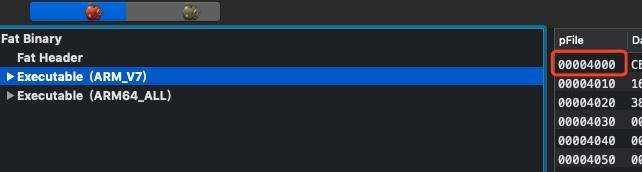
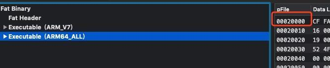

### mach_header
对于不是fat的Macho文件一开始的内容就是mac_header

#### 结构
```
struct mach_header {
	uint32_t	magic;		/* mach magic number identifier */
	cpu_type_t	cputype;	/* cpu specifier */
	cpu_subtype_t	cpusubtype;	/* machine specifier */
	uint32_t	filetype;	/* type of file */
	uint32_t	ncmds;		/* number of load commands */
	uint32_t	sizeofcmds;	/* the size of all the load commands */
	uint32_t	flags;		/* flags */
};
```
1. magic、cputype、cpusubtype：同上；
2. filetype：Macho文件的类型，也就是文章一开始列举的类型；
3. ncmds：接下来load commands的数量，后面会介绍；
4. sizeofcmds：接下来load commands的大小，后面会介绍；
5. flags：文件的表示信息，值如下：
```
/* Constants for the flags field of the mach_header */
#define    MH_NOUNDEFS 0x1     /* the object file has no undefinedreferences */
#define    MH_INCRLINK 0x2     /* the object file is the output of an
                       incremental link against a base file
                       and can't be link edited again */
#define MH_DYLDLINK    0x4     /* the object file is input for the
                       dynamic linker and can't be staticly
                       link edited again */
#define MH_BINDATLOAD  0x8     /* the object file's undefined
                       references are bound by the dynamic
                       linker when loaded. */
#define MH_PREBOUND    0x10        /* the file has its dynamic undefined
                       references prebound. */
#define MH_SPLIT_SEGS  0x20        /* the file has its read-only and
                       read-write segments split */
#define MH_LAZY_INIT   0x40        /* the shared library init routine is
```

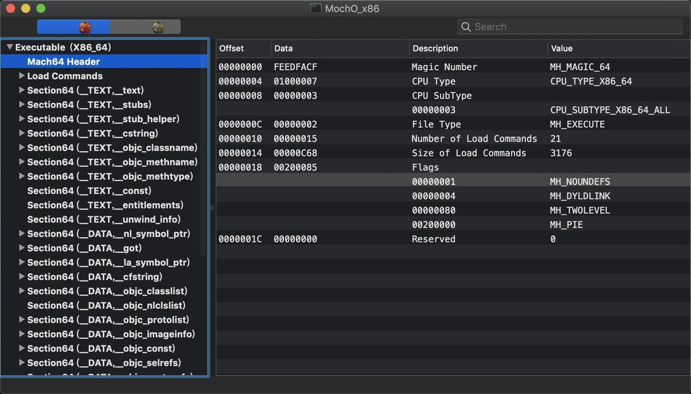

同样使用otool也是可以的

```
 MochO otool -h 执行文件名称
 Mach header
      magic cputype cpusubtype  caps    filetype ncmds sizeofcmds      flags
 0xfeedfacf 16777223          3  0x00           2    21       3176 0x00200085
```

上面显示该文件的类型为MH_EXECUTE，Load Commands的数量为21个，数一下确实是21个。
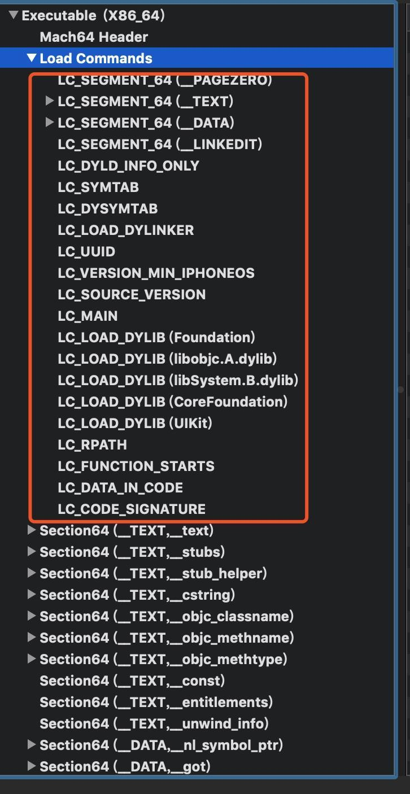

也就是说mach_header更多的是对load Commands的描述

### load Commands

load Commands是由很多的LC_Type组成的，而LC_Type有很多种,可在文件loader.h文件中查看，这边就列出前几种

```
/* Constants for the cmd field of all load commands, the type */
#define	LC_SEGMENT	0x1	/* segment of this file to be mapped */
#define	LC_SYMTAB	0x2	/* link-edit stab symbol table info */
#define	LC_SYMSEG	0x3	/* link-edit gdb symbol table info (obsolete) */
[...]
```

而每个LC_Type都会有一个头部load_command结构如下

```
struct load_command {
	uint32_t cmd;		/* type of load command */
	uint32_t cmdsize;	/* total size of command in bytes */
};
```

是的就是对segment的描述
1. cmd ： 当前load command的类型；
2. cmdsize：load command的大小。

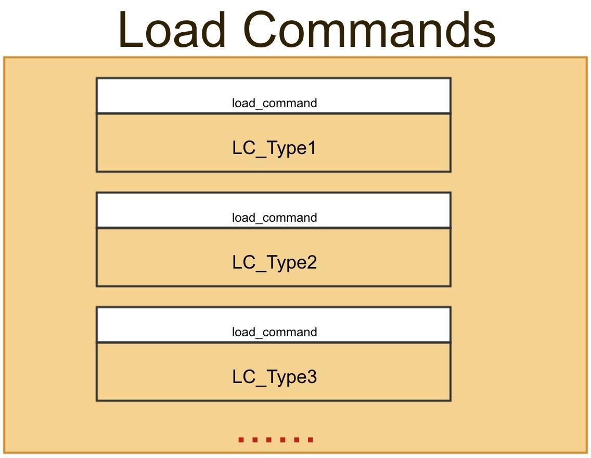

#### (1) LC_SEGMENT

为了方便管理，程序在内存中是分段管理的，先来看看LC_Type其中一种LC_SEGMENT的结构

```
struct segment_command { /* for 32-bit architectures */
	uint32_t	cmd;		/* LC_SEGMENT */
	uint32_t	cmdsize;	/* includes sizeof section structs */
	char		segname[16];	/* segment name */
	uint32_t	vmaddr;		/* memory address of this segment */
	uint32_t	vmsize;		/* memory size of this segment */
	uint32_t	fileoff;	/* file offset of this segment */
	uint32_t	filesize;	/* amount to map from the file */
	vm_prot_t	maxprot;	/* maximum VM protection */
	vm_prot_t	initprot;	/* initial VM protection */
	uint32_t	nsects;		/* number of sections in segment */
	uint32_t	flags;		/* flags */
};
```

1. cmd和cmdsize： 就是上面的load_command类型；
2. segname：就是当前segment的名称
3. vmaddr：在虚拟内存中的地址，这个很重要的，以后会介绍到
4. vmsize：在虚拟内存中所占用的大小；
5. fileoff：在文件中的偏移量；
6. fileoff：在文件中的偏移量；
7. maxprot：表示页面所需要的最高内存保护；
8. initprot:表示页面初始的内存保护;
9. nsects: 当前segment有多少个sections
10. flags：表示段的标志信息。

常见的LC_SEGMENT有以下几种

```
#define	SEG_PAGEZERO	"__PAGEZERO"
#define	SEG_TEXT	"__TEXT"	/* the tradition UNIX text segment */
#define	SEG_DATA	"__DATA"	/* the tradition UNIX data segment */
```


1. __PAGEZERO
这是一个不可读、不可写、不可执行的空间，能够在空指针访问时抛出异常。这个段的大小，32位上是 0x4000，64位上0000000100000000也就是 4G，4GB 并不是文件的真实大小，但是规定了进程地址空间的前 4GB 被映射为 不可执行、不可写和不可读，是从0（也是NULL指针的位置）开始的，这就是为什么当读写一个 NULL 指针或更小的值时会得到一个 EXC_BAD_ACCESS 错误。
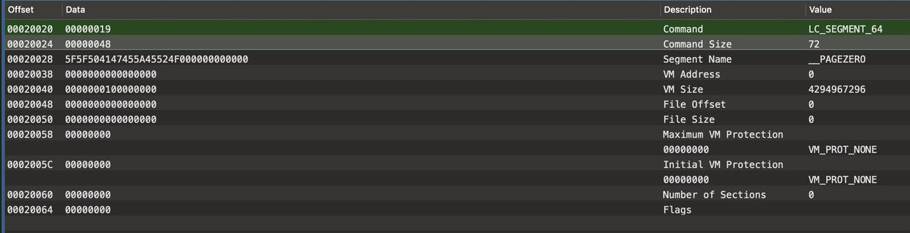

2. __TEXT

这是程序的代码段，该段是可读可执行，但是不可写。常见的section如下
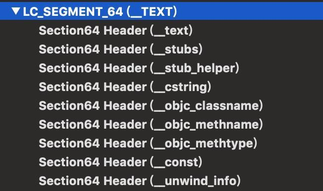

3. __DATA
数据段，包含了可读写数据。常见的section如下
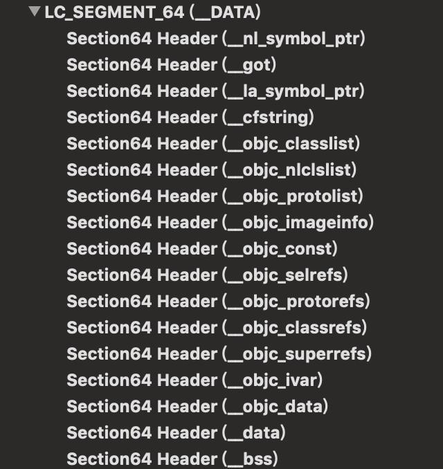


#### (2) LC_DYLD_INFO_ONLY
LC_DYLD_INFO_ONLY和LC_DYLD_INFO是同一个结构

```
struct dyld_info_command {
   uint32_t   cmd;      /* LC_DYLD_INFO or LC_DYLD_INFO_ONLY */
   uint32_t   cmdsize;      /* sizeof(struct dyld_info_command) */
 
   uint32_t   rebase_off;   /* file offset to rebase info  */
   uint32_t   rebase_size;  /* size of rebase info   */
 
   uint32_t   bind_off; /* file offset to binding info   */
   uint32_t   bind_size;    /* size of binding info  */
 
   uint32_t   weak_bind_off;    /* file offset to weak binding info   */
   uint32_t   weak_bind_size;  /* size of weak binding info  */
 
   uint32_t   lazy_bind_off;    /* file offset to lazy binding info */
   uint32_t   lazy_bind_size;  /* size of lazy binding infs */
 
   uint32_t   export_off;   /* file offset to lazy binding info */
   uint32_t   export_size;  /* size of lazy binding infs */
};
```

这个command是dyld在将二进制文件装载到内存链接的时候使用的
1. 前面2个不介绍了，rebase：由于Macho被加载到内存的时候首地址不是固定的，是随机分配的，针对这个做修正的；
2. bind：在链接的时候对一些符号进行绑定的，比如我们用到了UIKIT框架的api，但是二进制中又没有这个符号，此刻就是做这个对应的工作；
3. lazy_bind：就是一开始不必要立即绑定，后面用到的时候再绑定。

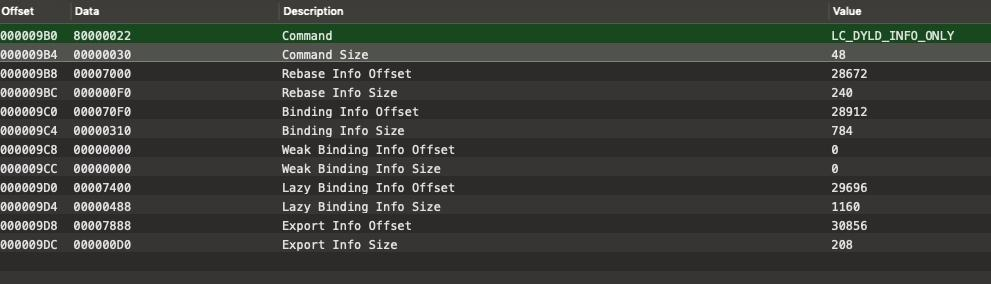

可以通过偏移量找到对应的地方
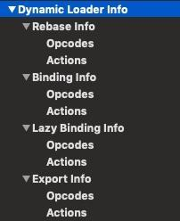

#### (3) LC_SYMTAB
这里面记录着所有的符号信息


```c++
struct symtab_command {
	uint32_t	cmd;		/* LC_SYMTAB */
	uint32_t	cmdsize;	/* sizeof(struct symtab_command) */
	uint32_t	symoff;		/* symbol table offset */
	uint32_t	nsyms;		/* number of symbol table entries */
	uint32_t	stroff;		/* string table offset */
	uint32_t	strsize;	/* string table size in bytes */
};

```

1. `symoff`:符号表的偏移量；
2. `nsyms`：符号表的元素的数量；
3. `stroff`：符号的字符串的偏移量；
4. `strsize`：所占的字节数。

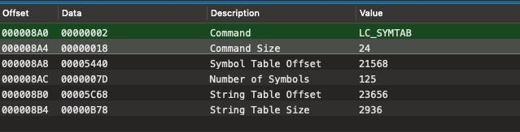

###### 查看Symbol Table

上面说到`symbol`的偏移量为`21568`也就是`0x0000 5440` 

选择如下

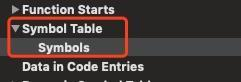


看到下图

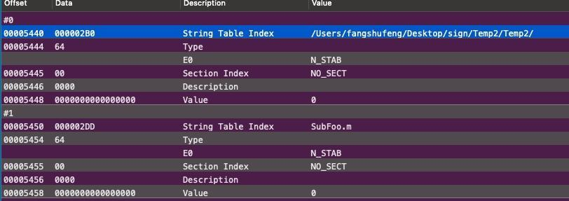

`Symbol Table`装着都是结构`nlist_64`或者`nlist`可以`see <mach-o/nlist.h> `


```c++
struct nlist_64 {
    union {
        uint32_t  n_strx; /* index into the string table */
    } n_un;
    uint8_t n_type;        /* type flag, see below */
    uint8_t n_sect;        /* section number or NO_SECT */
    uint16_t n_desc;       /* see <mach-o/stab.h> */
    uint64_t n_value;      /* value of this symbol (or stab offset) */
};

```

1. `n_strx`: 在`String Table`中的索引值；
2. `n_type`: 可选的值有`N_STAB`、`N_PEXT`、`N_TYPE`、`N_EXT`；
3. `n_sect`： `section`的类型，要么就是`NO_SECT`；
4. `n_desc`：
5. `n_value`: 符号对应的地址

这里以`AppDelegate`的符号`_OBJC_CLASS_$_AppDelegate`来演示

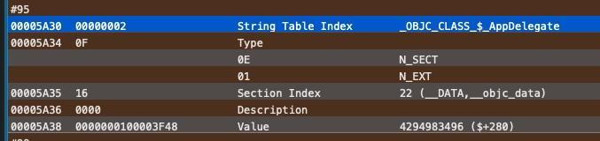

根据图得出以下信息：

1. `n_sect`显示位于`__DATA,__objct_data`；
2. `value`显示地址为`0x100003F48`。

跳到对应的地址看到确实是我们要找的：

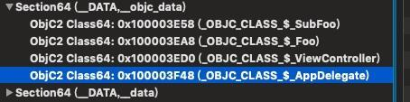

具体的数据如图

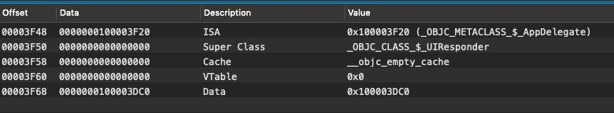

读出以下信息：

1. `_OBJC_CLASS_$_AppDelegate`的isa是_OBJC_METACLASS_$_AppDelegate;
2. 父类是`UIResponder`
3. 此时的缓存是空
4. 缓存的数量为0
5. 当前类相关的信息在地址`0x100003DC0`;


到这是不是觉得特别熟悉呢，我们把`AppDelegate`的代码用`c++`看下


```
xcrun -sdk iphoneos clang -arch arm64 -rewrite-objc AppDelegate.m
```

可以看到


```c++
extern "C" __declspec(dllexport) struct _class_t OBJC_CLASS_$_AppDelegate __attribute__ ((used, section ("__DATA,__objc_data"))) = {
	0, // &OBJC_METACLASS_$_AppDelegate,
	0, // &OBJC_CLASS_$_UIResponder,
	0, // (void *)&_objc_empty_cache,
	0, // unused, was (void *)&_objc_empty_vtable,
	&_OBJC_CLASS_RO_$_AppDelegate,
};
static void OBJC_CLASS_SETUP_$_AppDelegate(void ) {
	[...这里删除了元类的信息]
	
	OBJC_CLASS_$_AppDelegate.isa = &OBJC_METACLASS_$_AppDelegate;
	OBJC_CLASS_$_AppDelegate.superclass = &OBJC_CLASS_$_UIResponder;
	OBJC_CLASS_$_AppDelegate.cache = &_objc_empty_cache;
}

```

和我们的工具看到的不谋而合

我们继续跳到`0x100003DC0`看下


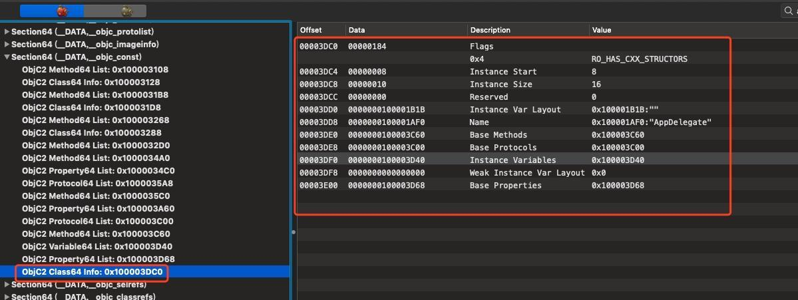


确实看到了我们要的信息，而右边的又是什么呢，由刚才的`C++`代码可以知道`0x100003DC0`就是`_OBJC_CLASS_RO_$_AppDelegate`的地址

看下`_class_ro_t`的结构

```c++
struct _class_ro_t {
	unsigned int flags;
	unsigned int instanceStart;
	unsigned int instanceSize;
	const unsigned char *ivarLayout;
	const char *name;
	const struct _method_list_t *baseMethods;
	const struct _objc_protocol_list *baseProtocols;
	const struct _ivar_list_t *ivars;
	const unsigned char *weakIvarLayout;
	const struct _prop_list_t *properties;
};


```

这个结构也即是我们截图的内容真好匹配

```c++

static struct _class_ro_t _OBJC_CLASS_RO_$_AppDelegate __attribute__ ((used, section ("__DATA,__objc_const"))) = {
	0, 
	__OFFSETOFIVAR__(struct AppDelegate, _window), 
	sizeof(struct AppDelegate_IMPL), 
	0, 
	"AppDelegate",
	(const struct _method_list_t *)&_OBJC_$_INSTANCE_METHODS_AppDelegate,
	(const struct _objc_protocol_list *)&_OBJC_CLASS_PROTOCOLS_$_AppDelegate,
	(const struct _ivar_list_t *)&_OBJC_$_INSTANCE_VARIABLES_AppDelegate,
	0, 
	(const struct _prop_list_t *)&_OBJC_$_PROP_LIST_AppDelegate,
};


```

所以到这里我们可以知道该类的所有信息了，比如我们想看看它得方法列表，由截图可以知道地址为`0x0000000100003C60`

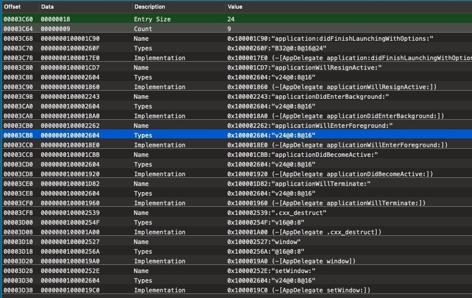


每一个item对应的就是`_objc_method`

```c++
struct _objc_method {
	struct objc_selector * _cmd;
	const char *method_type;
	void  *_imp;
};

```

比如我们现在想到拿到方法`- (BOOL)application:(UIApplication *)application didFinishLaunchingWithOptions:(NSDictionary *)launchOptions`的名称，看图可以知道方法的字符串地址为`0000000100001C90`


果然找到了，其它的信息可以自己尝试去找找。更多关于类方面的知识可以看下我之前的oc主题相关的文章，现在文章已经很长了，不说这个了。


###### 查看`String Table`

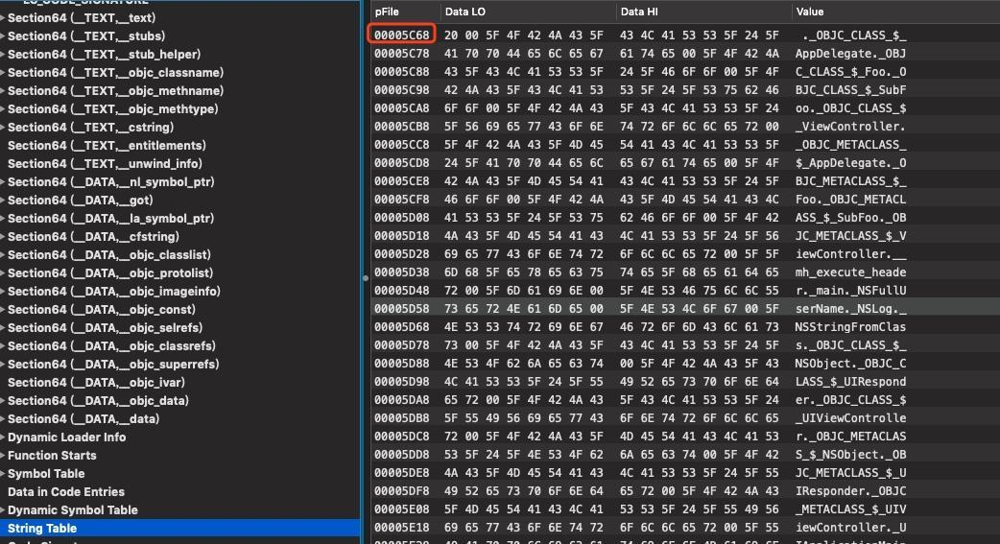


##### `LC_DYSYMTAB`

这里记录着所有的动态链接时需要的符号信息

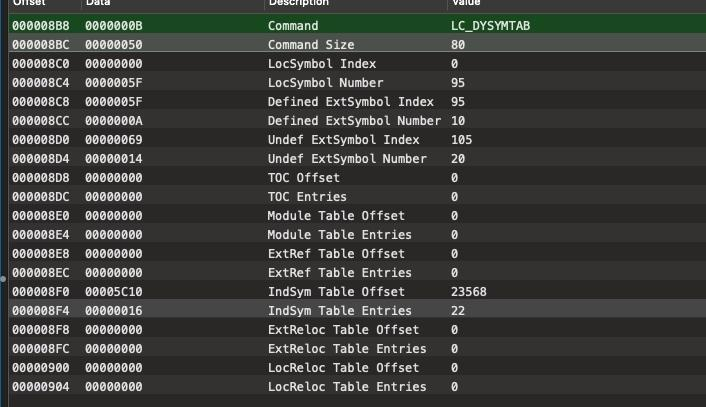


同样我们找到`00005C10`

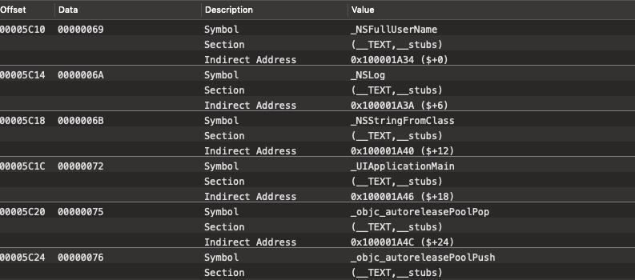

还有很多没有截取了，比如这些`_NSFullUserName`这些在链接的时候回去动态解析这些符号表

这个`Indirect Symbols`包含了所有和动态库相关的符号，包括`__DATA,__la_symbol_ptr`、`__DATA,__nl_symbol_ptr`、`__DATA,__got`，这个表有以下用处：

1. 通过这个表的`Symbol`可以找到在符号表`Symbol Table`的位置，从而在字符串表`String Table`中找到名称；
2. 通过这个表的`Indirect Address`可以在`__DATA,__la_symbol_ptr`、`__DATA,__nl_symbol_ptr`、`__DATA,__got`中找到方法的地址

[fishook](https://github.com/facebook/fishhook)就用到了这个

##### `LC_MAIN`

指定了`main`函数的入口地址

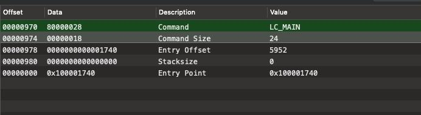


加载到内存后增加头部地址就是函数的真正地址了

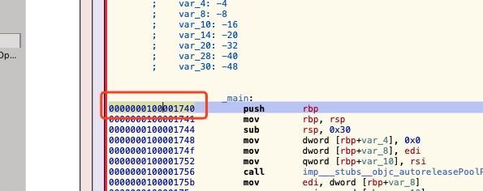


##### `LC_LOAN_DYLIB`

描述了一些动态库相关的信息

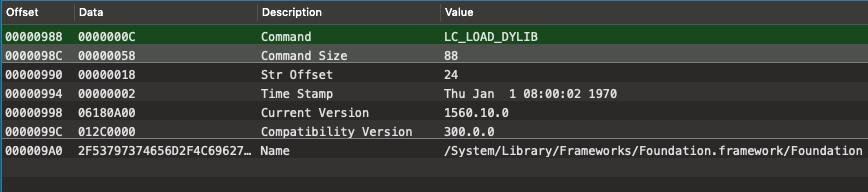

```c++

struct dylib {
    union lc_str  name; /* library's path name */
    uint32_t timestamp;	/* library's build time stamp */
    uint32_t current_version; /* library's current version number */
    uint32_t compatibility_version; /* library's compatibility vers number*/
};

struct dylib_command {
	uint32_t	cmd;		/* LC_ID_DYLIB, LC_LOAD_{,WEAK_}DYLIB,LC_REEXPORT_DYLIB */
	uint32_t	cmdsize;	/* includes pathname string */
	struct dylib	dylib;		/* the library identification */
};


```

##### `LC_RPATH`

`Runpath`的简写

程序运行链接路径

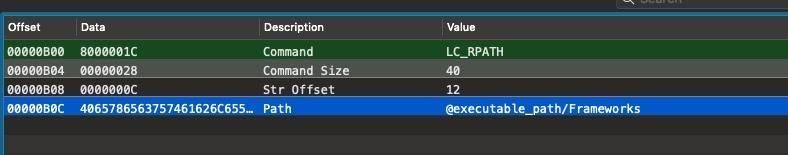


xcode中可以看到

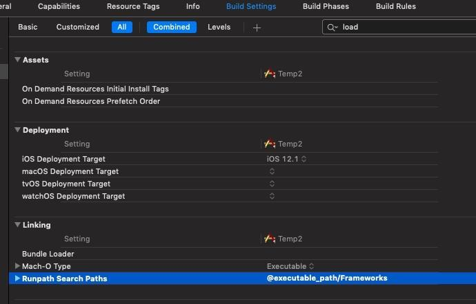


##### `LC_FUNCTION_STARTS`

方法是从哪里开始的
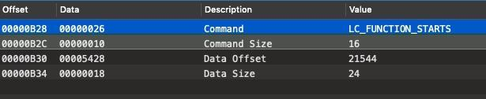

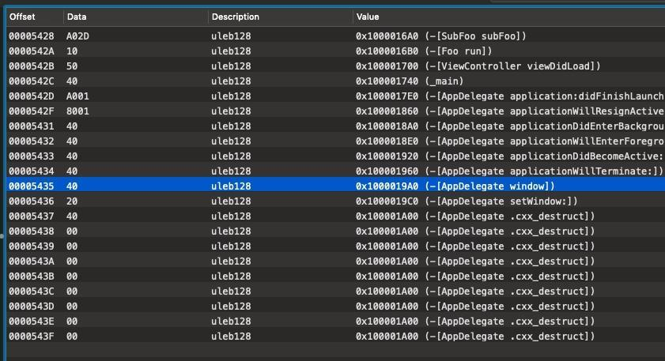


和解析出来的顺序也是一致的

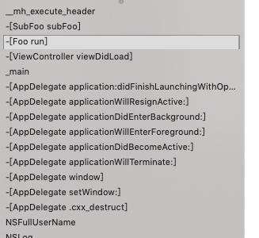


##### `LC_CODE_SINGATURE`

签名相关的信息
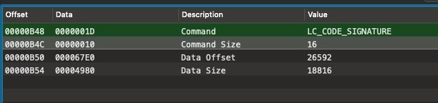


找到地方`0x67E0`

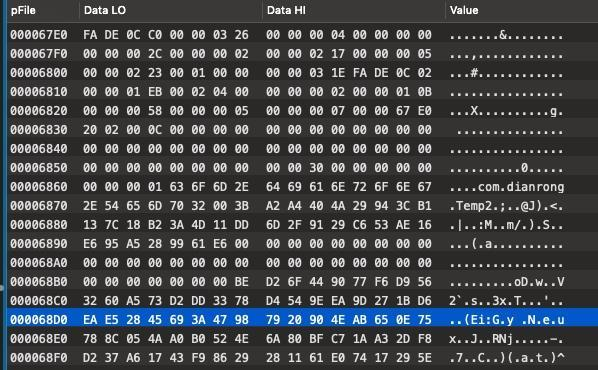


#### section

结构如下

```c++
struct section_64 { /* for 64-bit architectures */
	char		sectname[16];	/* name of this section */
	char		segname[16];	/* segment this section goes in */
	uint64_t	addr;		/* memory address of this section */
	uint64_t	size;		/* size in bytes of this section */
	uint32_t	offset;		/* file offset of this section */
	uint32_t	align;		/* section alignment (power of 2) */
	uint32_t	reloff;		/* file offset of relocation entries */
	uint32_t	nreloc;		/* number of relocation entries */
	uint32_t	flags;		/* flags (section type and attributes)*/
	uint32_t	reserved1;	/* reserved (for offset or index) */
	uint32_t	reserved2;	/* reserved (for count or sizeof) */
	uint32_t	reserved3;	/* reserved */
};
```

这里只列举了`section64`位的，`section`可以自己在`#include <mach-o/loader.h>`查看

1. `sectname`：当前`section`的名字;
2. `segname`：位于哪个`segment`;
3. `addr`:当前`section`在内存中的地址；
4. `size`:当前的`section`所占的内存大小；
5. `offset`：当前`section`的偏移量；
6. `reloff`: 抱歉暂时没找到实际的用处，不做解释,以免误人子弟；
7. `nreloc`：这个就是表示上面`reloff`的数量；
8. `flags`: 这个是当前`section`的标志位，包括`sectionType`和`sectionAttribute`,一个`section`可以有多个属性，但是只能有一个类型，这个很好理解了，可以通过位运算分别获取类型和属性，`(section->flags & SECTION_TYPE`、`section->flags & SECTION_ATTRIBUTES`
9. `reserved1`：这是个保留字段，它可以表示偏移量也可以用来表示索引，一般用来表示`Indirect Symbol Index`也就是间接索引表的位置，你可以在`__got`、`__subs`等中可以查看；
10. `reserved3`：也是个保留字段，一般表示数量的，比如在`__subs`section中就表示`subs`的个数；
11. `reserved3`：这个真是个保留字段了，暂时没什么用处


随意截取一个`section`看下结构吧

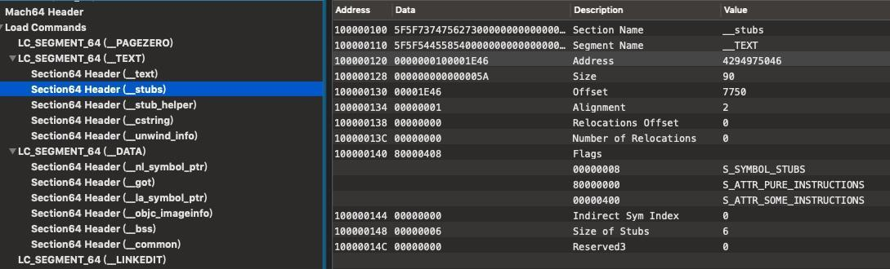

```


