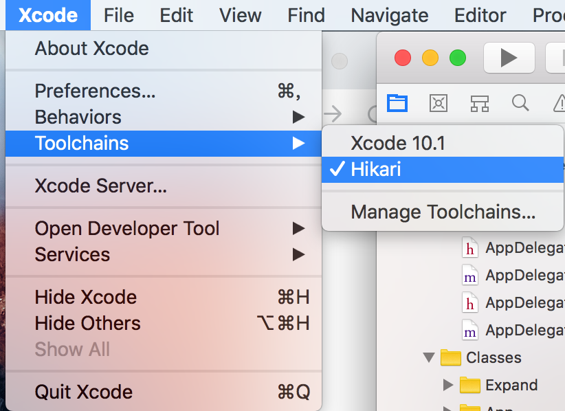
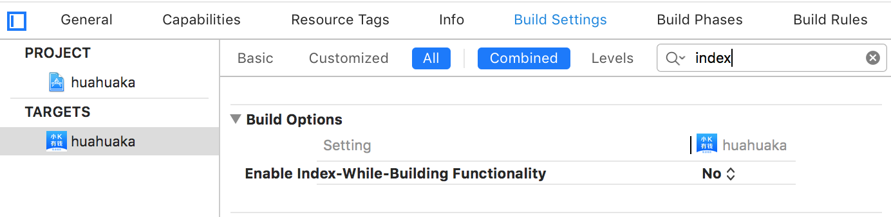
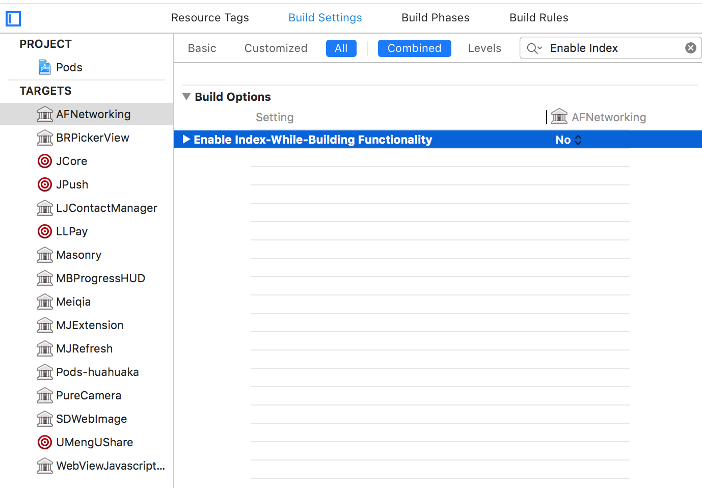
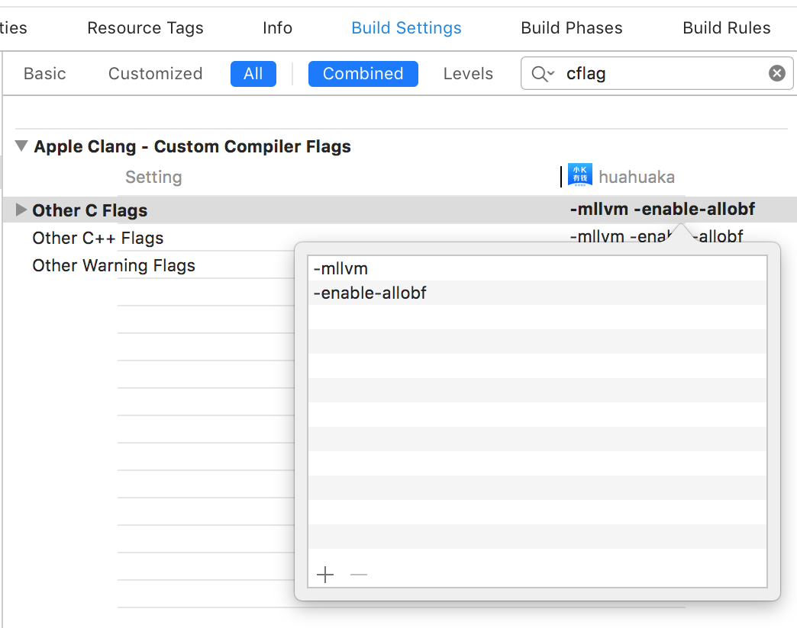

# 基于llvm对代码进行混淆(Hikari)

[Hikari:](https://github.com/HikariObfuscator/Hikari) 基于llvm层面对代码进行混淆

### 1. 获取工具链
#### 方法一: 直接使用作者编译好的  
下载地址:[https://github.com/HikariObfuscator/Hikari/releases](https://github.com/HikariObfuscator/Hikari/releases)

#### 方法二: 自己下载源码编译
源码地址:[https://github.com/HikariObfuscator/Hikari](https://github.com/HikariObfuscator/Hikari)

获取源码:

```
git clone --recursive -b release_80 https://github.com/HikariObfuscator/Hikari.git Hikari && cd Hikari && git submodule update --remote --recursive
```

编译并安装:

```
cd ../ && mkdir Build && cd Build && cmake -G "Ninja" -DLLDB_CODESIGN_IDENTITY='' -DCMAKE_BUILD_TYPE=MinSizeRel -DLLVM_APPEND_VC_REV=on -DLLVM_CREATE_XCODE_TOOLCHAIN=on -DCMAKE_INSTALL_PREFIX=~/Library/Developer/ ../Hikari && ninja &&ninja install-xcode-toolchain && git clone https://github.com/HikariObfuscator/Resources.git ~/Hikari && rsync -a --ignore-existing /Applications/Xcode.app/Contents/Developer/Toolchains/XcodeDefault.xctoolchain/ ~/Library/Developer/Toolchains/Hikari.xctoolchain/ && rm ~/Library/Developer/Toolchains/Hikari.xctoolchain/ToolchainInfo.plist
```

CMake编译命令：`cmake -G <generator> [options] <path to llvm sources>`

    **generator commands**:

    * `Unix Makefiles` — 生成和 make 兼容的并行的 makefile。

    * `Ninja` — 生成一个 Ninja 编译文件，大多数 LLVM 开发者使用 Ninja。

    * `Visual Studio` — 生成一个 Visual Studio 项目。

    * `Xcode` — 生成一个 Xcode 项目。

    **options commands**
    
    * `-DCMAKE_INSTALL_PREFIX=`"directory" — 安装 LLVM 工具和库的完整路径，默认`/usr/local`。

    * `-DCMAKE_BUILD_TYPE=`"type" — type 的值为`Debug`,`Release`, `RelWithDebInfo`和`MinSizeRel`，默认`Debug`。

    * `-DLLVM_ENABLE_ASSERTIONS=`"On" — 在启用断言检查的情况下编译，默认为`Yes`。

##### 方式一：使用 ninja 进行编译

使用`ninja`进行编译则还需要安装[`ninja`](https://ninja-build.org/)。
使用`$ brew install ninja`命令即可安装`ninja`。

1. 在`llvm`源码根目录下新建一个`llvm_build`目录，最终会在`llvm_build`目录下生成`build.ninja`。

2. 在`llvm`源码根目录下新建一个`llvm_release`目录，最终编译文件会在`llvm_release`文件夹路径下。

    * `$ cd llvm_build`
    
    * `$ cmake -G Ninja ../llvm -DCMAKE_INSTALL_PREFIX= 安装路径（本机为/Users/xxx/xxx/LLVM/llvm_release`，注意`DCMAKE_INSTALL_PREFIX`后面不能有空格。

    ```
    cmake -G "Ninja" -DLLDB_CODESIGN_IDENTITY='' -DCMAKE_BUILD_TYPE=MinSizeRel -DLLVM_APPEND_VC_REV=on -DLLVM_CREATE_XCODE_TOOLCHAIN=on -DCMAKE_INSTALL_PREFIX=~/Library/Developer/
    ```
    
3. 依次执行编译、安装指令。
    
    * `$ ninja`
    
    * `$ ninja install`

##### 方式二：使用 Xcode 进行编译
    
1. 在`llvm`源码根目录的同级下创建一个名为`llvm_xcode`的目录，并`$cd llvm_xcode`进入到`llvm_xcode`。


2. 这里我们使用`$ cmake -G Xcode ../llvm`命令生成一个`Xcode`项目。

3. 编译，选择`ALL_BUILD` Secheme 进行编译，预计`1+`小时。


### 2. 安装

将Hikari.xctoolchain解压到`~/Library/Developer/Toolchains/`或`/Library/Developer/Toolchains/` 即可。区别是前者只有当前用户可用，后者所有用户都可使用

### 3. 使用
1.选择Xcode -> Toolchains -> HikariObfuscator将混淆工具和项目关联。



2.将项目中所有target（包括pod进来的三方库）Enable Index-While-Building Functionality设为NO



三方库target忘记设置的话会报如下两个错误：
`-index-store-path cannot specify -o when generating multiple output files`


3.Optimization Level 的值设置为 None[-O0]  

4.在 Build Settings -> Other C Flags 中加入混淆标记 

```
-mllvm -enable-bcfobf 启用伪控制流
-mllvm -enable-cffobf 启用控制流平坦化
-mllvm -enable-splitobf 启用基本块分割
-mllvm -enable-subobf 启用指令替换
-mllvm -enable-acdobf 启用反class-dump
-mllvm -enable-indibran 启用基于寄存器的相对跳转，配合其他加固可以彻底破坏IDA/Hopper的伪代码(俗称F5)
-mllvm -enable-strcry 启用字符串加密
-mllvm -enable-funcwra 启用函数封装
-mllvm -enable-allobf 依次性启用上述所有
```



> 编译完成后混淆就完成了，可以用hopper工具进行对比
